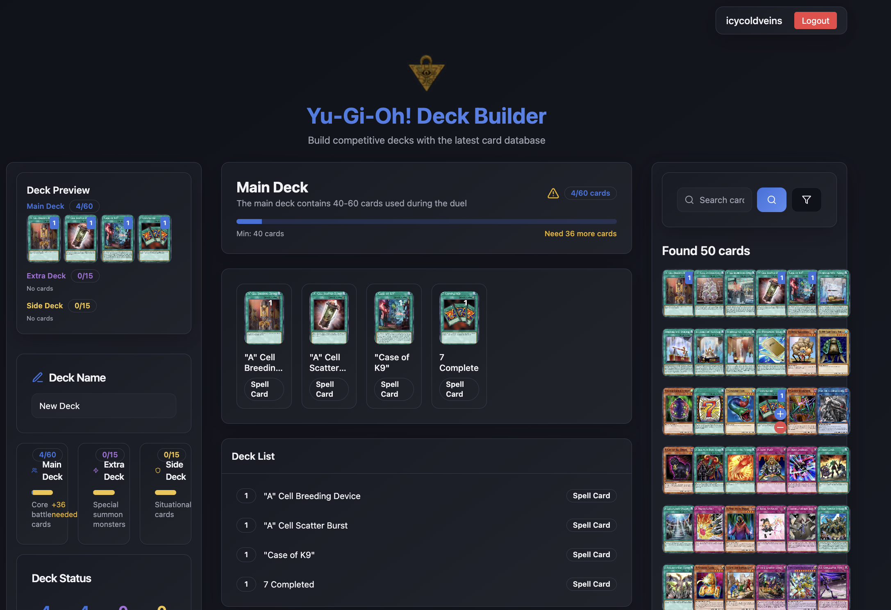

# Yu-Gi-Oh! Deck Builder



## Description
A modern, high-performance Yu-Gi-Oh! deck builder for creating, managing, and analyzing competitive decks. Built with a focus on usability, speed, and actionable data insights, this app empowers duelists to construct tournament-legal decks, explore the latest card database, and visualize deck statistics—all in a beautiful, responsive interface.

---

## Features

- **Deck Building**: Create, edit, and manage Main, Extra, and Side decks with intuitive drag-and-drop and validation.
- **Card Search**: Instantly search and filter from a database of 12,000+ Yu-Gi-Oh! cards.
- **Deck Validation**: Real-time legality checks (e.g., 40–60 main deck cards, 15 extra/side deck max).
- **Statistics & Metrics**: Visualize card type distribution, archetype diversity, deck legality rates, and more.
- **Authentication**: Secure sign-up and login with Supabase.
- **Responsive UI**: Mobile-friendly, dark mode, and smooth animations.
- **Performance**: Fast load times and API responses (<300ms typical).
- **Export/Import**: Export decklists for tournaments or sharing (if implemented).

---

## Tech Stack

- **Frontend**: React (TypeScript), Vite, Tailwind CSS, shadcn-ui, Radix UI, Zustand, React Query, Lucide React, Recharts
- **Backend**: Supabase (Postgres, Auth, Storage, Functions)
- **Tooling**: ESLint, Prettier, PostCSS, Autoprefixer, Jest/React Testing Library (if used)
- **Other**: Axios, clsx, tailwind-merge, date-fns, embla-carousel-react, zod

---

## Getting Started

### Prerequisites

- Node.js & npm

### Installation

```sh
git clone <YOUR_GIT_URL>
cd <YOUR_PROJECT_NAME>
npm install
npm run dev
```

Visit [http://localhost:8080](http://localhost:8080) to view the app.

---

## Usage

- **Build a Deck**: Add cards to your Main, Extra, and Side decks. The app enforces Yu-Gi-Oh! rules and provides real-time feedback.
- **Search Cards**: Use the search bar and filters to find cards by name, type, attribute, etc.
- **View Stats**: See deck composition, legality, and card type breakdowns in the Deck Stats panel.
- **Save & Export**: Save decks to your profile and export decklists for tournaments (if enabled).

---


## Deployment

Deploy to Vercel, Netlify, or any static hosting provider that supports Vite builds.

---

## License

MIT

---

## Credits

- Card data from [YGOPRODeck API](https://db.ygoprodeck.com/api-guide/)
- Built with [shadcn/ui](https://ui.shadcn.com/), [Supabase](https://supabase.com/), and other third-party libraries.
